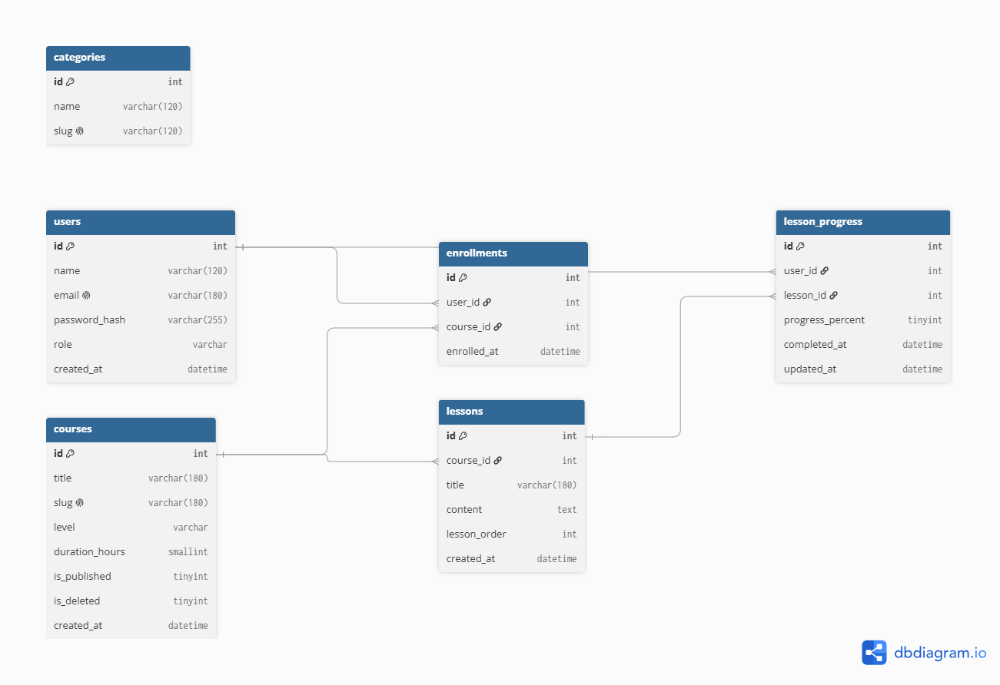

=========================================================================================================
# LMS - Quản lý khóa học

Ứng dụng PHP thuần dùng để quản lý danh sách khóa học, hỗ trợ thêm, sửa, xóa mềm, tìm kiếm và lọc khóa học.

## 1. Yêu cầu hệ thống

* Windows 10/11
* Laragon
* PHP 8.x trở lên
* MySQL 8.x
* Trình duyệt web: Chrome, Edge hoặc Firefox
* Git

Ứng dụng sử dụng PHP thuần, PDO và MySQL. Không sử dụng framework hoặc thư viện PHP bên ngoài.

## 2. Các bước dựng project

### Bước 1: Đặt project

Đặt thư mục `lms` vào:D:\laragon\www\lms

### Bước 2: Khởi động Laragon

Mở Laragon và khởi động:

* Apache
* MySQL

### Bước 3: Cấu hình database

Kiểm tra file `config.php` và thiết lập:

```php
'db_host' => '127.0.0.1',
'db_name' => 'lms_dev',
'db_user' => 'root',
'db_pass' => '',
'db_charset' => 'utf8mb4',
```

Trong môi trường local, tài khoản MySQL sử dụng mật khẩu trống.

### Bước 4: Truy cập ứng dụng

Mở trình duyệt và truy cập: http://localhost/lms/


## 3. Nhập schema.sql

Mở HeidiSQL hoặc MySQL.

Tạo database:

```sql
CREATE DATABASE lms_dev
CHARACTER SET utf8mb4
COLLATE utf8mb4_unicode_ci;
```

Sau đó chọn database `lms_dev` và chạy toàn bộ nội dung file: schema.sql

Kiểm tra database đã có bảng `courses`.

## 4. Chức năng chính

* Hiển thị danh sách khóa học.
* Tìm kiếm khóa học theo tiêu đề.
* Lọc khóa học theo level.
* Thêm khóa học.
* Kiểm tra dữ liệu phía máy chủ.
* Tự động tạo slug từ tiêu đề.
* Sửa khóa học.
* Xóa mềm bằng trường `is_deleted`.
* Không hiển thị khóa học đã xóa.
* Chống XSS khi hiển thị dữ liệu bằng `htmlspecialchars`.
* Sử dụng prepared statement khi truy vấn database.

## 5. Ảnh chụp giao diện

### Danh sách khóa học


### Form thêm khóa học


### Chức năng tìm kiếm

## 6. Ba lỗi thường gặp và cách xử lý

### Lỗi 1: Access denied for user 'root'@'localhost'

**Nguyên nhân:** Thông tin tài khoản MySQL trong `config.php` không đúng.

**Cách xử lý:** Kiểm tra:

```php
'db_host' => '127.0.0.1',
'db_user' => 'root',
'db_pass' => '',
'db_name' => 'lms_dev',
```

Đảm bảo MySQL đang chạy.

### Lỗi 2: Unknown database 'lms_dev'

**Nguyên nhân:** Database `lms_dev` chưa được tạo.

**Cách xử lý:** Tạo database:

```sql
CREATE DATABASE lms_dev
CHARACTER SET utf8mb4
COLLATE utf8mb4_unicode_ci;
```

Sau đó nhập file `schema.sql`.

### Lỗi 3: Không tìm thấy khóa học khi tìm kiếm

**Nguyên nhân:** Từ khóa không khớp với tiêu đề hoặc đang sử dụng bộ lọc level.

**Cách xử lý:** Kiểm tra lại từ khóa tìm kiếm và lựa chọn level. Để trống ô tìm kiếm và chọn `-- Tất cả level --` để hiển thị toàn bộ khóa học.

## 7. Git

Project được quản lý bằng Git theo quy trình làm việc nhóm.

Các chức năng được phát triển theo từng commit và sử dụng nhánh:

```text
feature/tim-kiem
```

Nhánh tính năng được tạo Pull Request để hợp nhất về:

```text
main
```
================================================================================================================
## 2.1.4 tham chiếu khóa ngoại 
| Bảng | Khóa ngoại | Tham chiếu | ON DELETE |
|---|---|---|---|
| lessons | course_id | courses(id) | CASCADE |
| enrollments | user_id | users(id) | RESTRICT |
| enrollments | course_id | courses(id) | CASCADE |
| lesson_progress | user_id | users(id) | RESTRICT |
| lesson_progress | lesson_id | lessons(id) | CASCADE |

- `lessons.course_id → courses.id`: sử dụng `ON DELETE CASCADE`
  vì khi khóa học bị xóa thì các bài học thuộc khóa học đó
  cũng không còn ý nghĩa.

- `enrollments.user_id → users.id`: sử dụng `ON DELETE RESTRICT`
  để không cho phép xóa người dùng khi vẫn còn dữ liệu đăng ký.

- `enrollments.course_id → courses.id`: sử dụng `ON DELETE CASCADE`
  vì khi khóa học bị xóa thì dữ liệu đăng ký khóa học đó cũng được xóa.

- `lesson_progress.user_id → users.id`: sử dụng `ON DELETE RESTRICT`
  để bảo vệ dữ liệu tiến độ học tập của người dùng.

- `lesson_progress.lesson_id → lessons.id`: sử dụng `ON DELETE CASCADE`
  vì khi bài học bị xóa thì tiến độ của bài học đó cũng không còn ý nghĩa.

  ## 2.1.5. ERD

Sơ đồ ERD của cơ sở dữ liệu sau khi mở rộng thành 6 bảng:


